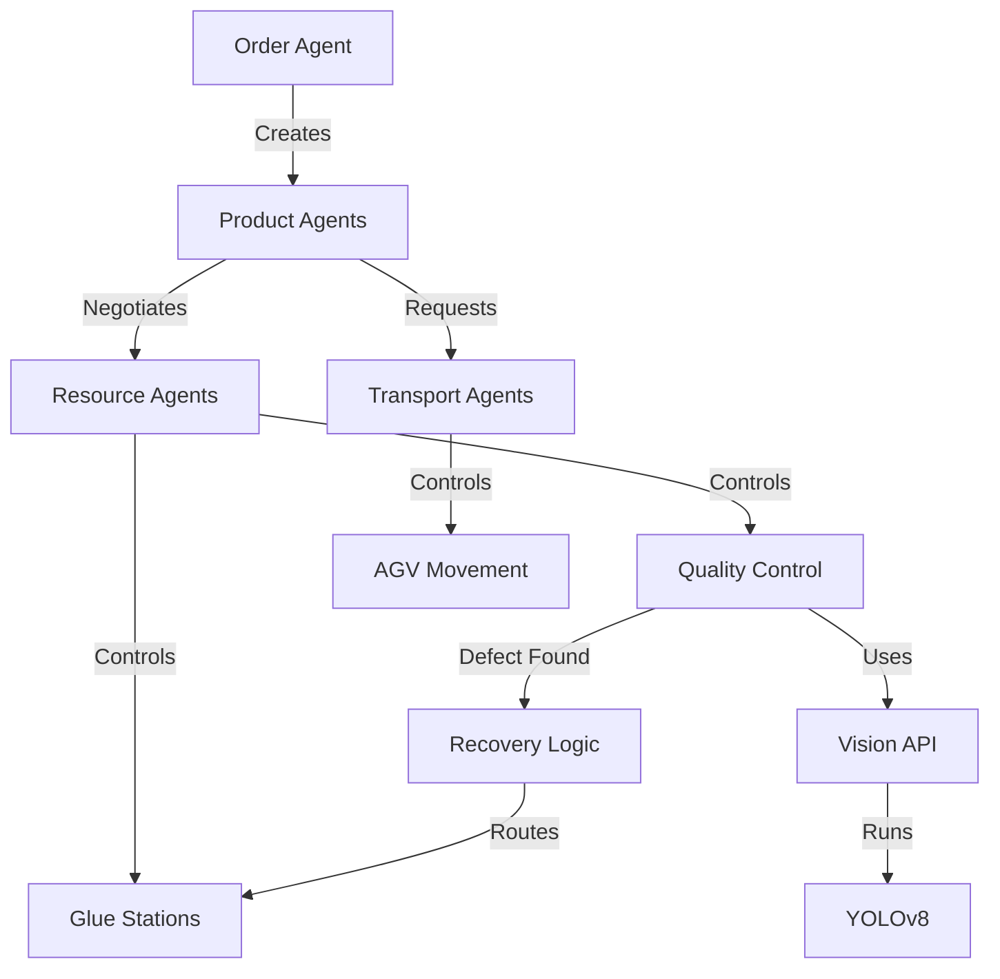
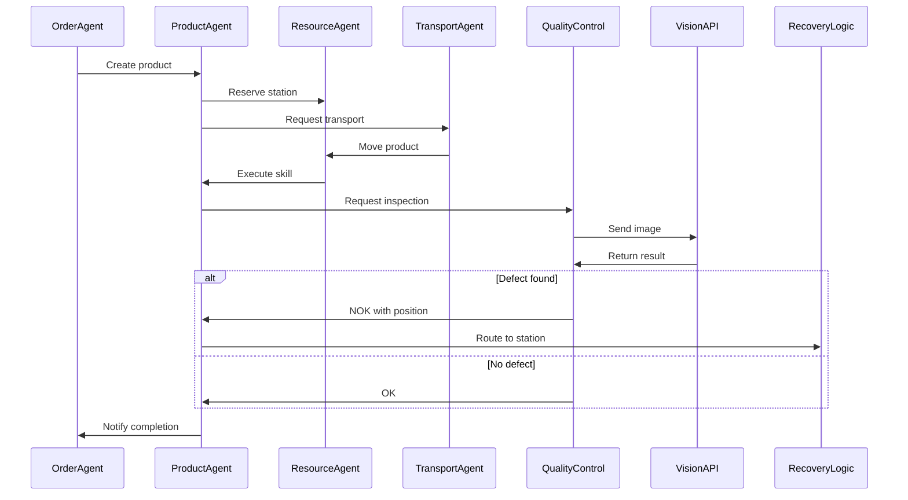

# Cyber-Physical Production System with Computer Vision Integration

This project implements a Cyber-Physical Production System (CPPS) using Multi-Agent Systems (MAS) with computer vision for defect detection in a manufacturing environment.

## Features

### 1. Agent System
- Product lifecycle management
- Resource allocation  
- Transportation scheduling* 
- Production order management

### 2. Quality Inspection
- Defect detection using YOLOv8
- Position-based defect classification
- REST API for inspection 

### 3. Defect Recovery
- Routing based on defect position
- Re-processing workflow
- Station selection logic

## System Architecture

### Agent & Vision Workflow

### Production Workflow

